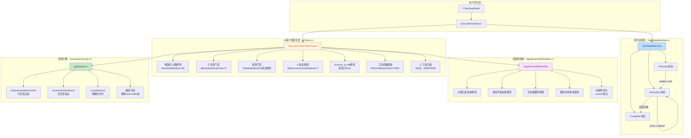

## 1. 高层摘要（TL;DR）

**影响范围**：🔴 **高** - 核心AI工具循环机制重构，新增任务状态机，大幅增强安全防护

**关键变更**：
- ✨ 新增 **TaskStateMachine** 强制AI按子任务清单顺序执行（Planning → Executing → Complete）
- 🛡️ 新增 **AgentEventSelfHandler** 自检测机制，自动识别死胡同并阻断
- 🔄 **AiClient** 工具循环安全机制：硬迭代上限（80轮）、AI复读检测、工具结果截断
- 📸 **AutomationScripts** 重构为Playwright风格快照引擎：可见性过滤 + 重要性评分
- 📝 上下文压缩策略优化：50KB触发→40KB，子任务完成时压缩至30KB
- 🗑️ 删除旧设计文档 `DESIGN.md`，新增Playwright MCP参考文档

---

## 2. 可视化概览（代码与逻辑映射）



**业务目标与模块映射**：

| 业务目标 | 核心模块 | 关键方法 |
|---------|---------|---------|
| 强制任务规划执行 | `TaskStateMachine` | `ProcessTodoUpdate()`, `ProcessStartSubtask()`, `ProcessFinishSubtask()` |
| 防止AI无限循环 | `AiClient` | `ExecuteConversationAsync()` - 硬迭代上限检测 |
| 识别死胡同并阻断 | `AgentEventSelfHandler` | `BeforeToolExecution()`, `ShouldTerminate()` |
| 优化页面快照质量 | `AutomationScripts` | `getSnapshot()` - Playwright风格过滤 |
| 控制上下文大小 | `AiClient` | `CompressHistory()` - 分级压缩策略 |

---

## 3. 详细变更分析

### 3.1 新增任务状态机（TaskStateMachine.cs）

**新增文件**：`Demo/BrowserDemo/Services/TaskStateMachine.cs`

**核心功能**：
- **三态流转**：`Planning` → `Executing` → `Complete`
- **强制顺序执行**：子任务必须按列表顺序执行，不可跳过
- **状态校验**：
  - `update_todo` 仅在 Planning 状态允许
  - `start_subtask` / `finish_subtask` 仅对当前 `ActiveSubtaskId` 允许
  - 执行中调用 `update_todo` 会被拒绝

**关键方法**：

| 方法 | 功能 | 返回值 |
|------|------|--------|
| `ProcessTodoUpdate()` | 建立任务清单，首个子任务自动标记为 in_progress | `TransitionResult` + `CompressionLevel.None` |
| `ProcessStartSubtask()` | 开始执行当前子任务，触发标准压缩 | `TransitionResult` + `CompressionLevel.Standard` |
| `ProcessFinishSubtask()` | 结束当前子任务，自动推进下一个，completed时触发最大压缩 | `TransitionResult` + `CompressionLevel.Max/None` |

**数据结构**：

```csharp
public enum TaskState { Planning, Executing, Complete }
public enum CompressionLevel { None, Standard, Max }

public class TransitionResult {
    public bool Valid { get; }
    public string? Error { get; }
    public CompressionLevel Compression { get; }
    public IReadOnlyList<TaskItem> TodoItems { get; }
}
```

---

### 3.2 AI客户端安全机制增强（AiClient.cs）

**变更文件**：`Demo/BrowserDemo/Services/AiClient.cs`

#### 3.2.1 常量调整

| 配置项 | 旧值 | 新值 | 说明 |
|-------|------|------|------|
| `ContextCompressionTriggerBytes` | 80,000 | 50,000 | 上下文压缩触发阈值降低 |
| `ContextCompressionTargetBytes` | 60,000 | 40,000 | 压缩目标值降低 |
| `ContextCompressionMaxTargetBytes` | - | 30,000 | 新增：子任务完成时最大压缩目标 |
| `MaxToolResultChars` | - | 2,000 | 新增：工具结果最大字符数 |
| `TruncateTailChars` | - | 500 | 新增：截断后保留尾部字符数 |
| `MaxHardIterations` | - | 80 | 新增：工具循环硬上限 |
| `MaxSubtaskGateTrips` | - | 5 | 新增：子任务门禁连续触发上限 |
| `MaxConsecutiveAiRepeats` | - | 2 | 新增：AI复读检测阈值 |

#### 3.2.2 新增安全机制

**硬迭代上限检测**：
```csharp
if (iteration >= MaxHardIterations) {
    Logger.Warning($"工具循环硬上限触发: 已达到 {MaxHardIterations} 轮，强制终止");
    yield return $"\n\n⛔ 工具调用已超过 {MaxHardIterations} 轮，系统强制终止本次请求...";
    yield break;
}
```

**AI复读检测**：
- 计算最近3轮AI文本回复的指纹（normalized hash）
- 连续2轮返回相同指纹（>30字符）→ 终止工具循环

**browser_js null检测**：
- 追踪连续 `browser_js` 调用返回 `{"data":"null"}` 或 `{"data":null}`
- 连续2次null后注入策略变更提示

**工具结果截断**：
```csharp
if (toolResult.Length > MaxToolResultChars) {
    displayResult = TruncateToolResult(tc.FunctionName, toolResult);
}
```

#### 3.2.3 子任务门禁增强

**旧逻辑**：连续3次不执行工具 → 接受文本输出
**新逻辑**：连续5次不执行工具 → 终止请求

```csharp
if (_consecutiveOpenSubtaskTextReplies <= MaxSubtaskGateTrips) {
    // 清理上一轮的子任务提醒，避免堆积污染上下文
    messages.RemoveAll(m => m.Role == MessageRole.System &&
        m.Content.StartsWith("当前仍有已开始但尚未结束的子任务", StringComparison.OrdinalIgnoreCase));
    // 注入新提醒
    continue;
}
Logger.Warning($"子任务门禁连续 {_consecutiveOpenSubtaskTextReplies} 次仍未生效，AI 持续输出文本而不执行工具，终止本轮请求");
yield break;
```

#### 3.2.4 规划门禁集成TaskStateMachine

**优先使用状态机状态判断**：
```csharp
var sm = ContextBuilder.TaskStateMachine;
if (sm != null) {
    switch (sm.CurrentState) {
        case TaskState.Planning:
            return "update_todo";
        case TaskState.Executing when string.IsNullOrEmpty(sm.ActiveSubtaskId):
            return "start_subtask";
        case TaskState.Complete:
            return null;
        case TaskState.Executing:
            return null;
    }
}
// 兜底：旧消息历史扫描逻辑
```

---

### 3.3 自检测机制增强（AgentEventSelfHandler.cs）

**变更文件**：`Demo/BrowserDemo/Services/AgentEventSelfHandler.cs`

**新增字段**：
```csharp
private int _staleElementTerminations;  // 过期元素终止计数
```

**新增终止条件**：
```csharp
if (_staleElementTerminations >= 3) {
    _terminateMessage = $"⛔ AI 已连续 {_staleElementTerminations} 次尝试复用过期元素导致死胡同，系统已中止工具循环。页面结构可能已发生变化，请刷新页面后重新开始任务。";
}
```

**自检测能力汇总**：

| 检测类型 | 触发条件 | 处理方式 |
|---------|---------|---------|
| 过期元素复用 | 同一element_id重复使用2次 | 阻断 + 死胡同评分+1 |
| 重复导航失败 | 同URL失败2次或同主机失败4次 | 阻断 + 死胡同评分+1 |
| 无进展循环 | 被动工具连续产生相同结果4次 | 注入警告 + 死胡同评分+1 |
| 相同动作重复 | 同一工具+参数产生相同结果3次 | 阻断 + 死胡同评分+1 |
| ask_user建议追踪 | 工具结果多次建议ask_user但未采纳 | 终止 |
| 过期元素终止 | 累计3次过期元素终止 | 强制终止 |

---

### 3.4 快照引擎重构（AutomationScripts.cs）

**变更文件**：`Demo/BrowserDemo/Services/Automation/AutomationScripts.cs`

#### 3.4.1 Playwright风格可见性过滤

**新增函数**：
```javascript
function isElementHiddenForAria(el) {
    if (el.tagName === 'SCRIPT' || el.tagName === 'STYLE' || el.tagName === 'NOSCRIPT') return true;
    if (el.matches('[hidden], [aria-hidden="true"]')) return true;
    var role = (el.getAttribute('role') || '').toLowerCase();
    if (role === 'presentation' || role === 'none') return true;
    // 检查父级元素的 display/visibility
    var node = el;
    while (node && node !== document.documentElement) {
        var style = getComputedStyle(node);
        if (!style || style.display === 'none' || style.visibility === 'hidden') return true;
        node = node.parentElement;
    }
    return false;
}

function receivesPointerEvent(el) {
    var rect = el.getBoundingClientRect();
    return rect.width > 0 && rect.height > 0;
}
```

#### 3.4.2 元素重要性评分

**新增函数**：
```javascript
function scoreElement(el) {
    var tag = (el.tagName || '').toLowerCase();
    var role = (el.getAttribute('role') || '').toLowerCase();
    var text = ((el.textContent || '') + '').trim();
    var aria = (el.getAttribute('aria-label') || '').trim();
    var name = (el.getAttribute('name') || '').trim();
    var label = text || aria || name;
    var score = 0;

    var tagPriority = {
        'button': 100, 'menuitem': 95, 'switch': 90, 'tab': 85,
        'a': 80, 'checkbox': 75, 'radio': 70,
        'input': 65, 'select': 60, 'textarea': 55,
        'details': 50, 'summary': 45, 'label': 20, 'datalist': 30,
        'option': 25, 'combobox': 55
    };
    score += (tagPriority[tag] || tagPriority['role_' + role] || 10);

    // 按钮文本越短优先级越高
    if (tag === 'button' || role === 'button') {
        var len = label.length;
        if (len > 0 && len < 20) score += 50;
        else if (len < 50) score += 30;
    }

    // aria-label 加分
    if (aria && aria.length > 0) score += 20;

    // 纯展示元素降低
    if (!label && !aria && !name) score -= 20;

    return score;
}
```

#### 3.4.3 精简字段

**移除字段**：
- `rect`（坐标信息）
- `visible`（可见性标记）
- `css_selector`（CSS选择器）
- `checked`、`disabled`、`readonly`（状态标记）

**保留字段**：
- `id`、`tag`、`text`、`role`、`type`、`name`、`href`、`aria_label`、`placeholder`、`value`

**字段长度限制调整**：
- `text`：200字符 → 100字符
- `value`：100字符 → 50字符

#### 3.4.4 元素数量限制

| 配置项 | 旧值 | 新值 | 说明 |
|-------|------|------|------|
| `MaxSnapshotElements` | 1000 | 0（无上限） | 依靠重要性排序和上下文压缩控制大小 |

---

### 3.5 ChatViewModel集成TaskStateMachine（ChatViewModel.cs）

**变更文件**：`Demo/BrowserDemo/ViewModels/ChatViewModel.cs`

#### 3.5.1 新增字段

```csharp
private readonly TaskStateMachine _taskStateMachine = new();
```

#### 3.5.2 连接状态机到ContextBuilder

```csharp
_contextBuilder.TaskStateMachine = _taskStateMachine;
```

#### 3.5.3 重构子任务工具处理

**update_todo工具**：
```csharp
var result = _taskStateMachine.ProcessTodoUpdate(items);
if (!result.Valid)
    return $"❌ {result.Error}";

// 映射状态机项为 AiTodoItem 更新 UI
RunOnUiThread(() => {
    TodoItems.Clear();
    foreach (var item in result.TodoItems) {
        TodoItems.Add(new AiTodoItem {
            Id = item.Id,
            Title = item.Title,
            Status = item.Status,
            Notes = item.Status == "in_progress" ? summary : null
        });
    }
    OnPropertyChanged(nameof(TodoItems));
});
```

**start_subtask工具**：
```csharp
var result = _taskStateMachine.ProcessStartSubtask(id);
if (!result.Valid)
    return $"❌ {result.Error}";

if (result.Compression == CompressionLevel.Standard)
    return $"__SUBTASK_CONTEXT_COMPRESSED__:{msg}";
return msg;
```

**finish_subtask工具**：
```csharp
var result = _taskStateMachine.ProcessFinishSubtask(id, status);
if (!result.Valid)
    return $"❌ {result.Error}";

if (result.Compression == CompressionLevel.Max)
    return $"__SUBTASK_COMPLETED_COMPRESSED__:{msg}";
return msg;
```

#### 3.5.4 前置/后置检测

**前置检测**（工具循环开始前）：
```csharp
if (_taskStateMachine.CurrentState == TaskState.Planning) {
    AddSystemMessage(
        "如果你正在执行一个多步骤任务，请先调用 `update_todo` 创建完整的任务清单，" +
        "将任务拆分为 2-6 个可执行的子任务，然后按清单顺序逐步完成。"
    );
    mutableMessages = BuildApiConversationMessages();
}
```

**后置检测**（工具循环结束后）：
```csharp
if (_taskStateMachine.CurrentState == TaskState.Planning) {
    AddSystemMessage(
        "你还没有调用 `update_todo` 建立任务清单。如果这是一个多步骤任务，请先拆分任务清单再继续执行。"
    );
    Logger.Info("兜底检测：AI 本轮未调用 update_todo，已追加系统提醒");
}
```

#### 3.5.5 ask_user工具描述增强

**旧描述**：
```
[用户交互] 在执行过程中暂停并向用户提问。当你遇到以下情况时使用此工具：
(1) 不确定该采用哪种方案，需用户引导；(2) 需要确认潜在风险操作；
(3) 发现多个有效选项需要用户选择；(4) 需要只有用户才能提供的信息。
调用此工具后，执行会暂停，用户回答后自动恢复。
```

**新描述**：
```
[用户交互] 在执行过程中暂停并向用户提问。**严格限制使用条件**：
只有在以下情况才允许调用：(1) 用户任务中存在真正缺失的关键信息（如用户说'帮我登录'但未提供任何账号信息）；
(2) 遇到互斥的风险操作需用户确认（如删除数据）。
**禁止滥用**：如果用户已经在对话中提供了所需信息（如手机号、用户名等），
你必须直接使用 browser_type/browser_fill_form 等工具填入，不得反问。
如果存在多个可行路径但都可以推进，选最直接的执行，不要问用户。
调用此工具后，执行会暂停，用户回答后自动恢复。
```

---

### 3.6 文档更新

#### 3.6.1 CLAUDE.md

**新增章节**：
- 项目概述中增加任务状态机和自检测机制说明
- 新增 `AutomationScripts — JavaScript Snapshot Engine` 章节
- 新增 `AgentEventSelfHandler — Autonomous Dead-End Detection` 章节
- 新增 `TaskStateMachine — Forced Subtask Execution` 章节
- 新增 `ExecuteConversationAsync — Safety Layers` 章节

**更新内容**：
- 更新目录结构，标注新增模块
- 更新技术栈表格，增加任务管理和自检测机制
- 更新启动流程图，标注状态机激活

#### 3.6.2 README.md

**新增特性**：
- 任务状态机强制顺序执行
- 死胡同自检测
- AI复读检测
- 硬迭代上限

**新增章节**：
- `AutomationScripts — 页面快照 JS 引擎`
- `AgentEventSelfHandler — AI 自检测`
- `TaskStateMachine — 任务状态机`

**更新内容**：
- 更新特性表格
- 更新目录结构
- 更新启动流程图
- 更新故障排查章节

#### 3.6.3 新增文档

**Help/playwrightMCPScreenShot.md**：
- Playwright MCP页面快照策略总结
- 核心策略对比表
- ARIA Tree快照生成流程图
- 对我们的启示

**version.md**：
- 版本变更记录模板

#### 3.6.4 删除文档

**DESIGN.md**：
- 旧的设计文档（关于火山引擎ARK配置问题）

---

### 3.7 其他变更

#### 3.7.1 ContextBuilder.cs

**新增属性**：
```csharp
public TaskStateMachine? TaskStateMachine { get; set; }
```

**更新ClearRuntimeState**：
```csharp
public void ClearRuntimeState() {
    _runtimeToolEvidence.Clear();
    RuntimeHasTodoItems = false;
    RuntimeActiveSubtaskId = null;
    TaskStateMachine?.Reset();  // 新增
}
```

**更新系统提示词**：
- 新增"2.1 强制顺序执行（必须遵守）"章节
- 新增"4.1 禁止滥用 ask_user"章节
- 更新子任务执行规则说明

#### 3.7.2 .gitignore

**新增忽略项**：
```
项目to简历.md
```

---

## 4. 影响与风险评估

### 4.1 破坏性变更

| 变更类型 | 影响范围 | 说明 |
|---------|---------|------|
| **API行为变更** | `update_todo` / `start_subtask` / `finish_subtask` | 现在通过TaskStateMachine校验，不满足条件会返回错误 |
| **上下文压缩阈值** | 所有工具循环 | 压缩触发更频繁（50KB vs 80KB） |
| **工具结果截断** | 所有工具 | 超过2000字符会被截断 |
| **快照字段变更** | `browser_snapshot` / `observe_browser` | 移除rect/visible/css_selector等字段 |
| **子任务门禁终止** | 有未完成子任务的场景 | 连续5次不执行工具会终止（旧逻辑是接受文本） |

### 4.2 向后兼容性

**兼容性策略**：
- TaskStateMachine支持回退：如果为null，AiClient会使用旧的消息历史扫描逻辑
- 规划门禁兜底：状态机未初始化时，使用旧的软门禁模式

### 4.3 测试建议

#### 4.3.1 任务状态机测试

| 测试场景 | 预期行为 |
|---------|---------|
| Planning状态下调用start_subtask | 返回错误："尚未建立任务清单，请先调用 update_todo" |
| Executing状态下调用update_todo | 返回错误："当前正在执行子任务，必须先 finish_subtask" |
| 跳过子任务N直接执行N+1 | 返回错误："必须先完成当前子任务" |
| finish_subtask后自动推进下一个 | 下一子任务状态自动变为in_progress |
| 所有子任务完成后调用update_todo | 返回错误："所有子任务已完成，不能新建任务清单" |

#### 4.3.2 安全机制测试

| 测试场景 | 预期行为 |
|---------|---------|
| 工具循环达到80轮 | 强制终止，返回硬上限提示 |
| AI连续2轮返回相同文本（>30字符） | 终止工具循环 |
| browser_js连续2次返回null | 注入策略变更提示 |
| 连续5次有未完成子任务但不执行工具 | 终止请求 |
| 连续3次复用过期element_id | 强制终止工具循环 |

#### 4.3.3 快照引擎测试

| 测试场景 | 预期行为 |
|---------|---------|
| 页面包含大量隐藏元素 | 快照中不包含display:none/visibility:hidden的元素 |
| 页面包含按钮和导航链接 | 按钮优先级高于链接，排在快照前列 |
| 快照元素数量 | 无上限，依靠重要性排序 |
| 快照字段 | 不包含rect/visible/css_selector |

#### 4.3.4 上下文压缩测试

| 测试场景 | 预期行为 |
|---------|---------|
| 对话达到50KB | 触发压缩至40KB以下 |
| 子任务完成时 | 触发最大压缩至30KB以下 |
| 工具结果超过2000字符 | 截断为前2000+后500字符 |

---

## 5. 总结

本次重构是一次**核心AI工具循环机制的重大升级**，主要围绕三个方向：

1. **强制任务规划**：通过TaskStateMachine确保AI按子任务清单顺序执行，防止跳跃式操作
2. **安全防护增强**：多层防护机制（硬上限、复读检测、死胡同检测）防止AI陷入无限循环
3. **快照质量优化**：Playwright风格过滤和重要性评分，提升AI对页面结构的理解能力

这些变更显著提升了系统的**稳定性**和**可控性**，但也引入了一些**行为变更**，需要充分测试以确保向后兼容性。

**风险等级**：🔴 **高** - 核心逻辑变更，建议全面回归测试

**建议优先级**：
1. 🔥 **P0**：任务状态机基本功能测试（update_todo/start_subtask/finish_subtask）
2. 🔥 **P0**：安全机制测试（硬上限、复读检测、死胡同检测）
3. ⚠️ **P1**：快照引擎测试（可见性过滤、重要性评分）
4. ⚠️ **P1**：上下文压缩测试（阈值、压缩效果）
5. ℹ️ **P2**：文档更新验证