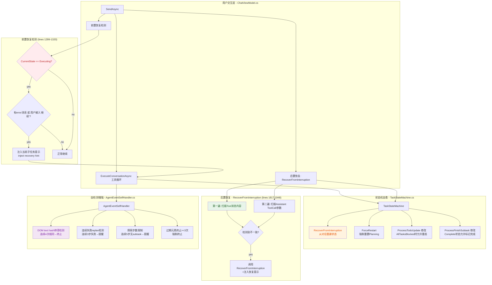

## 1. 高层摘要（TL;DR）

**影响范围**：🔴 **高** — 核心 AI 工具循环中断恢复机制，解决 API 超时后状态机混乱导致的无限拒绝循环

**关键变更**：
- 🐛 **根因诊断**：日志分析发现 HTTP 90s 超时后，状态机停留在不一致状态（Executing 无 ActiveSubtaskId / Complete 有未完成子任务），导致 AI 反复调用 update_todo / finish_subtask 被拒绝，陷入 ~24 轮循环
- 🔄 **三层恢复架构**：
  1. **前置恢复**（`SendAsync` 循环开始前）：检测 Executing 状态 + 错误消息/"继续" → 注入当前子任务提示
  2. **状态机自愈**（`TaskStateMachine`）：新增 `RecoverFromInterruption()` 从对话重建状态；`ForceRestart()` 强制重置；Complete 状态下 blocked 任务允许重启
  3. **后置恢复**（`SendAsync` 循环结束后）：两遍扫描对话提取子任务证据，检测不一致并修复
- 🛡️ **AgentEventSelfHandler** 新增 DOM text hash 页面停滞检测、连续失败 replan 检测、探索步数限制
- 🛡️ **AgentEventSelfHandler** 过期元素终止计数 >=3 时强制终止工具循环；导航失败阈值从同主机 4 次降至 3 次

---

## 2. 可视化概览（代码与逻辑映射）



**业务目标与模块映射**：

| 业务目标 | 核心模块 | 关键方法 |
|---------|---------|---------|
| 超时后恢复执行 | `ChatViewModel` | `SendAsync` 前置恢复检测 (lines 1299-1320) |
| 从对话重建状态 | `TaskStateMachine` | `RecoverFromInterruption()` (lines 222-291) |
| 强制重置任务 | `TaskStateMachine` | `ForceRestart()` (lines 297-302) |
| 循环后对齐状态 | `ChatViewModel` | `RecoverFromInterruption()` (lines 1817-1948) |
| 页面停滞检测 | `AgentEventSelfHandler` | `RecordDomTextHash()` (lines 131-158) |
| 连续失败 replan | `AgentEventSelfHandler` | `RecordActionOutcome()` (lines 161-182) |

---

## 3. 详细变更分析

### 3.1 日志根因分析（Log Analysis）

**日志文件**：`Demo/BrowserDemo/Log/6-16-14-12-11.log`（1750 行）

**时间线**：

| 时间 | 事件 |
|------|------|
| 14:17:51.740 | HTTP 90s 超时：`服务器未在时限内响应` |
| 14:17:51.740 | SSE error event，yield break，AI 回复 `服务器响应超时，请重试` |
| 14:20:34 | 用户输入"继续" |
| 14:20:34 ~ 14:22+ | 状态机混乱循环（~24 轮） |

**混乱循环过程**：

```
状态机状态: Executing (ActiveSubtaskId=step4, 但实际未执行)
  -> AI 调用 update_todo -> 被拒绝: "当前正在执行子任务 step4"
  -> AI 调用 finish_subtask(step4) -> 被拒绝: "当前正在执行 XXX，必须先完成它"
  -> AI 将所有剩余子任务 blocked -> 状态机进入 Complete
  -> AI 再次调用 update_todo -> 被拒绝: "所有子任务已完成"
  -> AI 放弃工具调用，返回纯文本 -> 循环继续
  -> 重复 ~24 轮...
```

**根因**：API 超时导致工具循环异常终止，但状态机内部状态与实际对话历史不一致。超时发生时 AI 可能已经调用了部分工具但结果未返回，状态机停留在 Executing 但 ActiveSubtaskId 指向一个实际上并未成功执行的子任务。

---

### 3.2 ChatViewModel 前置恢复检测

**变更文件**：`Demo/BrowserDemo/ViewModels/ChatViewModel.cs`（lines 1299-1320）

**新增逻辑**：在工具循环开始前，检测状态机是否处于 Executing 且有错误痕迹。

```csharp
// 前置恢复检测：如果状态机处于 Executing 但有 error 消息，注入进度提示
if (_taskStateMachine.CurrentState == TaskState.Executing)
{
    var lastUserMsg = mutableMessages.LastOrDefault(m => m.Role == MessageRole.User);
    var hasErrorInHistory = mutableMessages.Any(m =>
        m.Role == MessageRole.Assistant &&
        (m.Content?.Contains("超时", StringComparison.OrdinalIgnoreCase) == true ||
         m.Content?.Contains("服务器响应超时", StringComparison.OrdinalIgnoreCase) == true));
    var isResume = lastUserMsg?.Content?.Trim() == "继续";

    if (hasErrorInHistory || isResume)
    {
        var activeItem = _taskStateMachine.TodoItems.FirstOrDefault(t => 
            t.Id == _taskStateMachine.ActiveSubtaskId);
        if (activeItem != null)
        {
            var recoveryMsg = $"[系统提示] 当前任务清单状态：已完成子任务已完成（见下方 todo 列表）。" +
                $"当前正在执行子任务「{activeItem.Title}」(ID={_taskStateMachine.ActiveSubtaskId})。" +
                $"请继续完成此子任务，完成后调用 finish_subtask(status=\"completed\")。";
            AddSystemMessage(recoveryMsg);
            mutableMessages = BuildApiConversationMessages();
            Logger.Info($"前置恢复提示：当前子任务={activeItem.Title} (ID={_taskStateMachine.ActiveSubtaskId})");
        }
    }
}
```

**触发条件**（满足任一即可）：
1. 对话历史中有 AI 返回的"超时"/"服务器响应超时"消息
2. 用户最后一条消息为"继续"

**作用**：告诉 AI 当前应该继续执行哪个子任务，避免 AI 盲目尝试 update_todo 或 finish_subtask。

---

### 3.3 TaskStateMachine 自愈能力

**变更文件**：`Demo/BrowserDemo/Services/TaskStateMachine.cs`

#### 3.3.1 新增 `RecoverFromInterruption()` 方法（lines 222-291）

从对话历史中提取已完成/blocked 的子任务 ID，重建状态机内部状态。

```csharp
public bool RecoverFromInterruption(
    IReadOnlySet<string> completedSubtaskIds, 
    IReadOnlySet<string> blockedSubtaskIds)
```

**处理的两种情况**：

| 情况 | 旧状态 | 恢复动作 |
|------|--------|---------|
| 超时发生在执行中 | Complete（错误地全部完成） | 重建为 Executing，找到第一个 pending/in_progress 子任务设为 Active |
| 超时导致 Active 错乱 | Executing（Active 指向已完成的任务） | 纠正 ActiveSubtaskId 到正确的 pending/in_progress 任务 |

**核心逻辑**：

```csharp
// 同步每个子任务的状态
foreach (var item in _items)
{
    if (completedSubtaskIds.Contains(item.Id))
        item.Status = "completed";
    else if (blockedSubtaskIds.Contains(item.Id))
        item.Status = "blocked";
}

var allDone = _items.All(t => t.Status is "completed" or "blocked");
if (allDone)
{
    CurrentState = TaskState.Complete;
    ActiveSubtaskId = null;
}
else
{
    CurrentState = TaskState.Executing;
    var nextItem = _items.FirstOrDefault(t => t.Status is "pending" or "in_progress");
    if (nextItem != null)
    {
        if (nextItem.Status == "pending")
            nextItem.Status = "in_progress";
        ActiveSubtaskId = nextItem.Id;
    }
}
```

#### 3.3.2 新增 `ForceRestart()` 方法（lines 297-302）

```csharp
public void ForceRestart()
{
    CurrentState = TaskState.Planning;
    ActiveSubtaskId = null;
    _items.Clear();
}
```

用于用户在 Complete 状态下要求完全重新开始任务。

#### 3.3.3 `ProcessTodoUpdate()` 修改（lines 47-69）

**旧逻辑**：Complete 状态下始终拒绝 update_todo，返回"所有子任务已完成"。

**新逻辑**：当所有子任务均为 blocked 时，允许在 Complete 状态下重新调用 update_todo：

```csharp
if (CurrentState == TaskState.Complete)
{
    if (AllTasksBlocked)
    {
        _items.Clear();
        CurrentState = TaskState.Planning;
        // 允许继续创建新清单
    }
    else
    {
        return TransitionResult.Rejected("所有子任务已完成，不能新建任务清单。");
    }
}
```

#### 3.3.4 `ProcessFinishSubtask()` 修改（lines 150-166）

Complete 状态下允许 finish_subtask 清理标记剩余任务为 completed：

```csharp
if (CurrentState == TaskState.Complete)
{
    var existing = _items.FirstOrDefault(t => t.Id == subtaskId); // 重命名避免变量名冲突
    if (existing != null && status == "completed")
    {
        existing.Status = "completed";
        return TransitionResult.Accepted(_items);
    }
}
```

**修复的 bug**：原代码用 `target` 变量名导致与下方 Executing 路径的 `target` 冲突（CS0136 Variable shadowing），已重命名为 `existing`。

#### 3.3.5 新增 `AllTasksBlocked` 属性（line 307）

```csharp
public bool AllTasksBlocked => _items.Count > 0 && _items.All(t => t.Status == "blocked");
```

---

### 3.4 ChatViewModel 后置恢复（RecoverFromInterruption）

**变更文件**：`Demo/BrowserDemo/ViewModels/ChatViewModel.cs`（lines 1817-1988）

#### 3.4.1 两遍提取策略

**第一遍：扫描 Tool 消息内容**（lines 1827-1860）

从 `MessageRole.Tool` 的 `Content` 字段中提取 finish_subtask / start_subtask 的结果：

```csharp
foreach (var msg in conversation)
{
    if (msg.Role != MessageRole.Tool) continue;
    var content = msg.Content ?? "";
    
    if (msg.ToolName == "finish_subtask")
    {
        if (content.Contains("子任务完成", ...))
            // 提取 id -> completedIds
        else if (content.Contains("blocked", ...))
            // 提取 id -> blockedIds
    }
    else if (msg.ToolName == "start_subtask")
    {
        // 提取 id -> startedIds
    }
}
```

**第二遍：扫描 Assistant ToolCall 参数**（lines 1862-1897）

更可靠的方式，直接从 `Assistant` 消息中的 `ToolCalls` 提取实际参数：

```csharp
foreach (var msg in conversation)
{
    if (msg.Role != MessageRole.Assistant || !msg.HasToolCalls) continue;
    foreach (var tc in msg.ToolCalls!)
    {
        if (tc.FunctionName == "finish_subtask")
        {
            var args = tc.ParseArguments();
            var idStr = args["id"]?.ToString() ?? "";
            var statusStr = (args["status"]?.ToString() ?? "").ToLowerInvariant();
            if (statusStr.Contains("completed")) completedIds.Add(idStr);
            else if (statusStr.Contains("blocked")) blockedIds.Add(idStr);
        }
        else if (tc.FunctionName == "start_subtask")
        {
            // 提取 id -> startedIds
        }
    }
}
```

#### 3.4.2 不一致检测（lines 1914-1927）

```csharp
var isInconsistent = false;

// 情况1：Complete 但启动的子任务比完成的更多 -> 有子任务被跳过
if (_taskStateMachine.CurrentState == TaskState.Complete && 
    completedIds.Count < startedIds.Count)
{
    isInconsistent = true;
}

// 情况2：Executing 但有错误 -> 状态可能已损坏
if (_taskStateMachine.CurrentState == TaskState.Executing && hasError)
{
    isInconsistent = true;
}
```

#### 3.4.3 注入恢复提示（lines 1960-1988）

```csharp
private string? BuildRecoveryHint(
    HashSet<string> completedIds, 
    HashSet<string> blockedIds, 
    HashSet<string> startedIds)
```

三种恢复提示场景：

| 场景 | 提示内容 |
|------|---------|
| 全部 blocked | "所有子任务均被标记为受阻。你需要重新调用 update_todo 创建新的任务清单" |
| Executing + 有错误 | "已完成子任务: {xxx}。当前正在执行子任务「{title}」。请继续完成此子任务" |
| Complete + 有完成记录 | "所有子任务已完成（完成: {xxx}）。任务已结束" |

#### 3.4.4 辅助方法

**`ExtractJsonFromContent()`**（lines 1950-1958）：从工具结果字符串中提取 JSON 片段（找第一个 `{` 到最后一个 `}`）。

**`RecoverFromInterruption()` 调用位置**（line 1403）：在工具循环正常结束后立即调用，无论是否 ask_user 暂停。

---

### 3.5 AgentEventSelfHandler 新增检测

**变更文件**：`Demo/BrowserDemo/Services/AgentEventSelfHandler.cs`

#### 3.5.1 DOM text hash 页面停滞检测（lines 131-158）

```csharp
public void RecordDomTextHash(string domTextHash)
{
    if (string.IsNullOrEmpty(domTextHash) || domTextHash == "0" || domTextHash.StartsWith("error"))
        return;

    if (_previousDomTextHash != null && _previousDomTextHash == domTextHash)
    {
        _consecutiveDomUnchanged++;

        if (_consecutiveDomUnchanged == MaxDomUnchangedBeforeAlert) // 2
        {
            AddEvent("page_stalled", "warning", ...);
        }
        else if (_consecutiveDomUnchanged >= MaxDomUnchangedBeforeTerminate) // 4
        {
            _terminateMessage = $"页面内容已连续 {MaxDomUnchangedBeforeTerminate} 次未变化，工具循环判定为死胡同，强制终止。";
            AddEvent("page_stalled_fatal", "critical", ...);
        }
    }
    else
    {
        _consecutiveDomUnchanged = 0;
    }
    _previousDomTextHash = domTextHash;
}
```

**调用方**：由 `AiClient.ExecuteConversationAsync` 在 `browser_snapshot` / `observe_browser` 后调用，传入快照返回的 DOM text hash。

**触发条件**：

| 连续次数 | 处理方式 |
|---------|---------|
| 2 次 | 注入 warning 系统消息 |
| 4 次 | 强制终止工具循环 |

#### 3.5.2 连续失败 replan 检测（lines 161-182）

```csharp
public void RecordActionOutcome(bool isSuccess)
{
    if (!isSuccess)
    {
        _consecutiveActionFailures++;
        if (_consecutiveActionFailures == ReplanThreshold) // 3
        {
            AddEvent("replan_needed", "warning",
                $"已连续 {ReplanThreshold} 步操作失败或无进展。请调用 update_todo 重新规划子任务...");
        }
        else if (_consecutiveActionFailures > ReplanThreshold)
        {
            AddEvent("replan_critical", "critical",
                $"已连续 {_consecutiveActionFailures} 步失败，必须重新规划。");
        }
    }
    else
    {
        _consecutiveActionFailures = 0;
    }
}
```

#### 3.5.3 探索步数限制（lines 185-201）

```csharp
public void RecordStepWithSubtask(bool hasSubtaskAssociation)
{
    if (!hasSubtaskAssociation)
    {
        _consecutiveExplorationSteps++;
        if (_consecutiveExplorationSteps == ExplorationLimit) // 5
        {
            AddEvent("exploration_limit", "warning",
                $"已连续 {ExplorationLimit} 步操作未关联任何子任务。请调用 update_todo 制定明确计划...");
        }
    }
    else
    {
        _consecutiveExplorationSteps = 0;
    }
}
```

#### 3.5.4 过期元素终止计数增强（lines 212-216）

```csharp
public bool ShouldTerminate(out string userFacingMessage)
{
    if (_staleElementTerminations >= 3)
    {
        _terminateMessage = $"⛔ AI 已连续 {_staleElementTerminations} 次尝试复用过期元素导致死胡同，系统已中止工具循环。";
    }
    // ...
}
```

#### 3.5.5 导航失败阈值调整

**`TrackNavigationFailure`** 中同主机失败阈值从 4 次调整为 3 次（line 250）：

```csharp
if (urlFailures >= 2 || hostFailures >= 3)  // 旧值: hostFailures >= 4
```

---

### 3.6 编译修复

| 错误 | 原因 | 修复 |
|------|------|------|
| CS0136 Variable shadowing | `ProcessFinishSubtask` 中 Complete 路径和 Executing 路径都用 `target` 变量 | Complete 路径变量重命名为 `existing` |
| CS0103 Undefined variable | `wasInProgress` 在 foreach 循环内声明，但在循环外引用 | 将 `previousActiveId` 和 `previousState` 声明移到循环外 |
| CS8602 Null dereference | `msg.ToolCalls` 可能为 null | 添加 null-forgiving 运算符 `msg.ToolCalls!` |

---

## 4. 影响与风险评估

### 4.1 破坏性变更

| 变更类型 | 影响范围 | 说明 |
|---------|---------|------|
| **状态机 Complete 行为** | `update_todo` / `finish_subtask` | Complete 状态下，AllTasksBlocked 时允许 update_todo 重启；允许 finish_subtask 清理 |
| **前置恢复注入** | 所有 Executing 状态的请求 | 如果有"超时"或"继续"痕迹，会注入系统提示，改变 AI 收到的上下文 |
| **后置恢复注入** | 所有工具循环结束后 | 检测到不一致时会注入恢复提示 |
| **DOM 停滞检测** | 所有 snapshot/observe 调用 | 需要 AiClient 调用 RecordDomTextHash，否则不生效 |
| **导航失败阈值** | browser_navigate | 同主机失败从 4 次降至 3 次，更早阻断 |

### 4.2 向后兼容性

**兼容性策略**：
- 前置恢复只在 `CurrentState == Executing` 时注入提示，不影响 Planning/Complete 状态
- 后置恢复只在 `CurrentState != Planning` 时执行，Planning 状态无影响
- `RecoverFromInterruption` 在状态无变化时返回 false，不会误改状态

### 4.3 测试建议

#### 4.3.1 中断恢复测试

| 测试场景 | 操作步骤 | 预期行为 |
|---------|---------|---------|
| API 超时后用户输入"继续" | 触发 90s 超时 -> 输入"继续" | 注入当前子任务提示，AI 继续执行而非陷入拒绝循环 |
| 部分子任务完成后超时 | update_todo -> 完成 2/5 -> 超时 | 后置恢复检测到 2 个 completed，重建 Executing 状态，Active 指向第 3 个 |
| 全部 blocked 后重启 | AI 将所有子任务 blocked -> 状态 Complete -> 输入"继续" | update_todo 不被拒绝，状态回到 Planning |
| 正常完成无恢复 | 所有子任务正常完成 | 无恢复提示注入，状态保持 Complete |

#### 4.3.2 自检测测试

| 测试场景 | 预期行为 |
|---------|---------|
| 页面内容连续 4 次 hash 相同 | 终止工具循环，返回 page_stalled_fatal |
| 连续 3 步操作失败 | 注入 replan_needed 警告 |
| 连续 5 步未关联子任务 | 注入 exploration_limit 警告 |
| 过期元素终止累计 3 次 | 强制终止工具循环 |

---

## 5. 总结

本次变更围绕一个核心问题展开：**API 超时导致 AI 工具循环异常终止后，状态机与对话历史不一致，引发无限拒绝循环**。

解决方案分为三个层次：

1. **前置预防**：在工具循环开始前检测超时/恢复迹象，主动注入当前子任务提示，让 AI 知道从哪里继续。
2. **状态机自愈**：`TaskStateMachine` 新增 `RecoverFromInterruption()` 从对话重建状态，`ForceRestart()` 强制重置，`AllTasksBlocked` 时允许重启。
3. **后置对齐**：工具循环结束后扫描对话证据，检测不一致并修复，注入恢复提示。

同时增强了 `AgentEventSelfHandler` 的自检测能力：DOM text hash 页面停滞检测、连续失败 replan 检测、探索步数限制、过期元素终止计数。

**风险等级**：🔴 **高** — 修改了状态机的 Complete 状态行为，新增了系统消息注入逻辑，可能影响现有 AI 交互流程。

**建议优先级**：
1. 🔥 **P0**：超时恢复端到端测试（模拟 90s 超时 -> 输入"继续" -> 验证无拒绝循环）
2. 🔥 **P0**：部分完成后超时的恢复测试（验证 RecoverFromInterruption 正确重建状态）
3. ⚠️ **P1**：全部 blocked 后重启测试（验证 AllTasksBlocked 允许 update_todo）
4. ⚠️ **P1**：AgentEventSelfHandler 新增检测的集成测试
